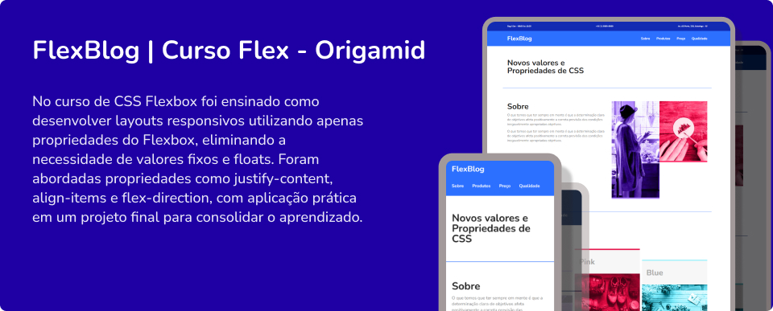
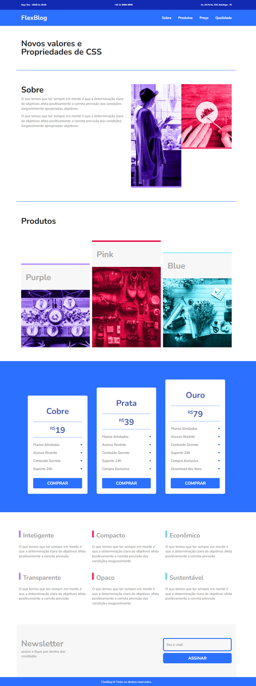

# FlexBlog - Curso CSS Flexbox (Origamid)

## 📚 Sobre o Projeto

Este repositório contém o projeto **FlexBlog**, desenvolvido durante o curso **[CSS Flexbox da Origamid](https://www.origamid.com/curso/css-flexbox)**.  
O objetivo é praticar e dominar o uso das propriedades do Flexbox no CSS para criação de **layouts responsivos** modernos e sem a necessidade de valores fixos ou uso excessivo de floats.

## 🎓 Curso

- Autor: **Origamid**
- Nome: **CSS Flexbox**
- Duração: **6 horas**

## 🧩 Conteúdos Aprendidos

Durante o curso, foram estudados e aplicados conceitos fundamentais do Flexbox:

- Flex Container
- Flex Item
- Flex-grow
- Flex-basis
- Flex-shrink
- Alinhamentos e distribuições
- Criação de layouts responsivos

## 🚀 Projeto Desenvolvido

O **FlexBlog** é um site fictício criado com HTML e CSS, onde foram aplicados na prática os conceitos de Flexbox:

- ✅ Cabeçalho responsivo com navegação
- ✅ Sessão de produtos organizada com Flexbox
- ✅ Tabelas de preços flexíveis
- ✅ Layout responsivo em diferentes resoluções
- ✅ Boas práticas de semântica e organização de código

## 📂 Estrutura do Projeto

├── index.html # Estrutura HTML do projeto
├── css/
│ └── style.css # Estilos CSS com Flexbox
└── img/ # Imagens utilizadas no projeto

## 🖼️ Prévia

Aqui está uma prévia do layout desenvolvido:

## 🏆 Créditos

Curso: [Origamid](https://www.origamid.com/curso/css-flexbox)
